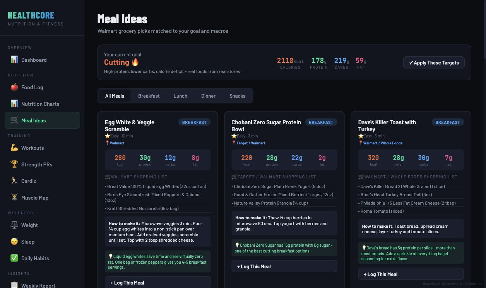
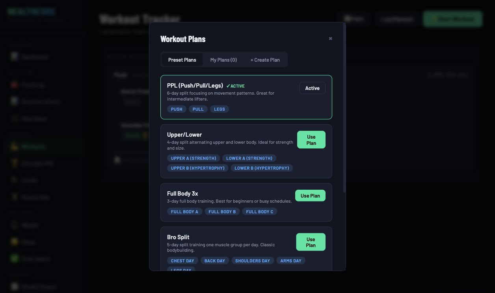
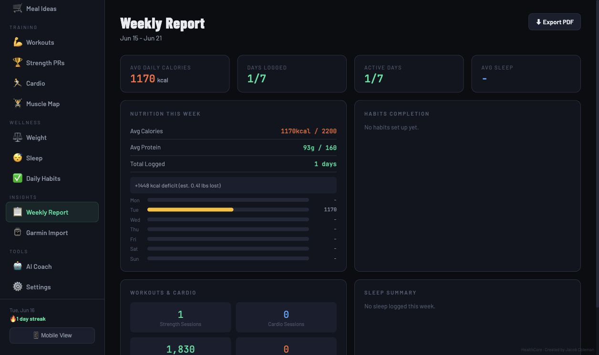

# HealthCore

HealthCore is a browser-based health and fitness dashboard for tracking nutrition, hydration, bodyweight, workouts, strength progress, and optional AI-assisted wellness reflections.

I built it as a practical health-tech project that connects my Kinesiology and Human Performance & Nutrition coursework with a usable consumer wellness tool. The app is intentionally lightweight: it runs as a static single-page app, stores data locally in the browser, and can be deployed on any static host.

[Live demo](https://jacobcoleman921.github.io/HealthCore/)


## Quick Review

In 3-5 minutes, reviewers can see:

- A working dashboard for calories, macros, water, sleep, recovery, workouts, and streaks
- Manual food entry, USDA FoodData Central search, food label scanning, and photo-based food estimates
- Meal Ideas with grocery-style meals organized by goal
- Workout logging, active workout mode, preset plans, custom plans, and exercise form cues
- Strength reporting with estimated one-rep maxes, percentile context, and muscle volume
- Weekly reports, weight tracking, goal settings, local data import/export, and optional coaching tools
- A privacy-conscious design with no backend and no account requirement

## Screenshots

| Dashboard | Meal Ideas |
| --- | --- |
|  |  |

| Workout Tracker | Workout Plans |
| --- | --- |
|  |  |

| Strength Report | Weekly Report |
| --- | --- |
|  |  |

| Settings |
| --- |
|  |

## Core Features

**Nutrition tracking**

- Daily calories, protein, carbs, fat, fiber, sodium, sugar, and micronutrients
- Goal progress bars for calorie, macro, and water targets
- USDA FoodData Central lookup with manual entry fallback
- Food label scan and food photo estimate flows using a user-provided Gemini key
- Personal food library for saving reusable meals or ingredients
- Meal suggestion engine with cutting, bulking, maintenance, and recomp options

**Training and strength**

- Push, pull, legs, shoulders, and custom workout logging
- Set-level weight and rep entry
- Preset and custom workout plans
- Active workout screen for faster in-session logging
- Exercise form cues for common lifts
- Estimated one-rep max calculations
- Strength percentile context for major lifts
- Muscle-group volume overview for recent training balance

**Reports, weight, and recovery**

- Bodyweight logging and trend chart
- Sleep import and sleep quality views
- Garmin import support for activities and sleep exports
- Weekly report for nutrition, training, sleep, and progress summaries
- Profile-based TDEE estimate
- Editable calorie, macro, and water goals
- JSON export for personal backup

**Optional coaching tools**

- Uses a user-provided Groq API key stored locally in the browser
- Summarizes nutrition, workouts, recovery, and goals
- Can generate meal plans, workout analysis, recovery advice, and program ideas
- Framed as general wellness reflection, not medical advice

## How It Works

HealthCore is a static app made with:

- HTML
- CSS
- Vanilla JavaScript
- Chart.js
- Browser `localStorage`
- USDA FoodData Central API
- Optional Groq API integration
- Optional Gemini API integration

There is no backend, database server, login system, or hosted user-data store. The app persists data under local `hc_*` keys in the user's browser.

## Run Locally

Clone the repository:

```bash
git clone https://github.com/JacobColeman921/HealthCore.git
cd HealthCore
```

Open `index.html` directly in a browser, or serve it locally:

```bash
python3 -m http.server 4173
```

Then visit:

```text
http://127.0.0.1:4173
```

No package install is required.

## Suggested Demo Flow

1. Open the dashboard and review the calorie, macro, water, and food summary cards.
2. Go to Meal Ideas and scan the goal-based meal suggestions.
3. Go to Food Log and add a manual food, search with USDA lookup, or review the label/photo tools.
4. Go to Workout, open Plans, and review preset or custom workout planning.
5. Go to Strength and Weekly Report to see training volume, maxes, recovery, and progress views.
6. Go to Settings to adjust profile data, goals, import/export data, or add optional Groq and Gemini keys.

## Privacy Notes

- HealthCore stores data locally in the browser.
- Exported JSON is generated client-side.
- The USDA search uses a public demo API key and may be rate limited.
- The Groq and Gemini keys are optional and stored locally only.
- AI output is for general wellness reflection and should not be treated as medical advice.

## Project Structure

```text
.
├── index.html
├── README.md
├── docs/
│   └── screenshots/
└── .gitignore
```

## Why I Built It

I wanted a project that showed more than a static landing page. HealthCore combines product thinking, health science context, interface design, and working browser-side functionality into one usable tool. It reflects my interest in fitness, human performance, nutrition, and AI-assisted software development.

## Author

Jacob Coleman<br>
[github.com/JacobColeman921](https://github.com/JacobColeman921)
