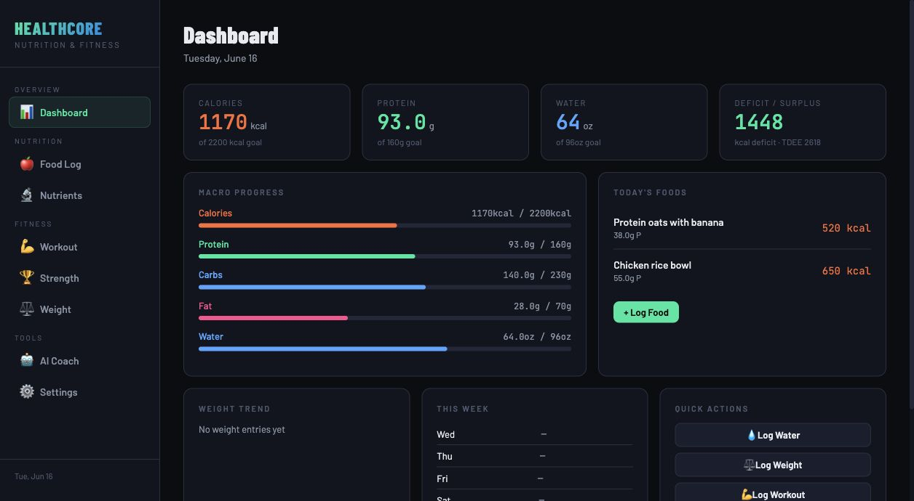
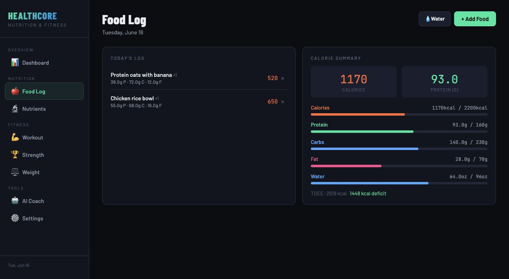
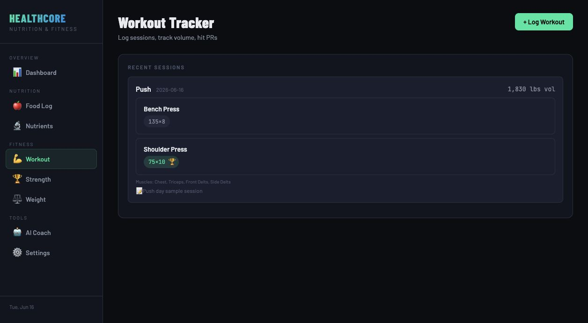
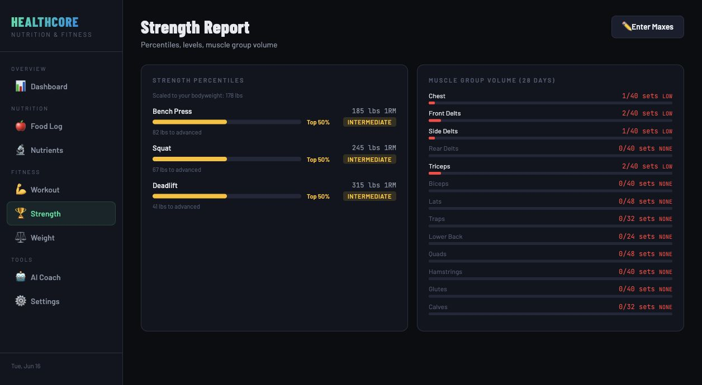
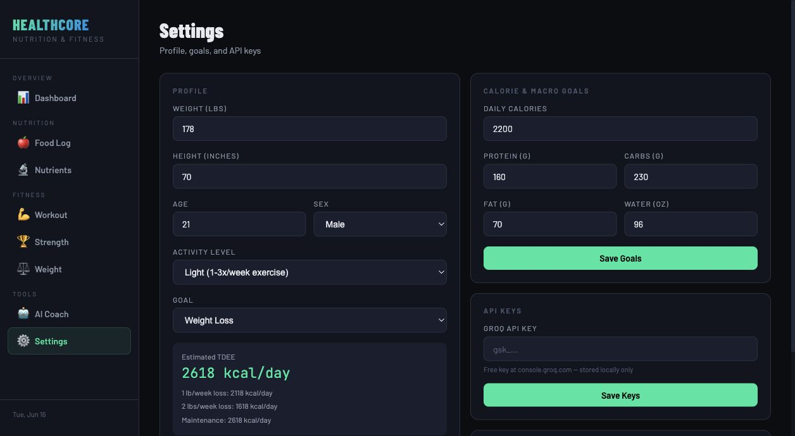

# HealthCore

HealthCore is a browser-based health and fitness dashboard for tracking nutrition, hydration, bodyweight, workouts, strength progress, and optional AI-assisted wellness reflections.

I built it as a practical health-tech project that connects my Kinesiology and Human Performance & Nutrition coursework with a usable consumer wellness tool. The app is intentionally lightweight: it runs as a static single-page app, stores data locally in the browser, and can be deployed on any static host.



## Quick Review

In 3-5 minutes, reviewers can see:

- A working nutrition dashboard with calories, macros, water, and daily food logs
- Manual food entry plus USDA FoodData Central search support
- Workout logging for push, pull, legs, shoulders, and custom sessions
- Strength reporting with estimated one-rep maxes, percentile context, and muscle volume
- Weight tracking, goal settings, local data export, and optional Groq AI Coach
- A privacy-conscious design with no backend and no account requirement

## Screenshots

| Dashboard | Food Log |
| --- | --- |
|  |  |

| Workout Tracker | Strength Report |
| --- | --- |
|  |  |

| Settings |
| --- |
|  |

## Core Features

**Nutrition tracking**

- Daily calories, protein, carbs, fat, fiber, sodium, sugar, and micronutrients
- Goal progress bars for calorie, macro, and water targets
- USDA FoodData Central lookup with manual entry fallback
- Personal food library for saving reusable meals or ingredients

**Training and strength**

- Push, pull, legs, shoulders, and custom workout logging
- Set-level weight and rep entry
- Estimated one-rep max calculations
- Strength percentile context for major lifts
- Muscle-group volume overview for recent training balance

**Weight and goals**

- Bodyweight logging and trend chart
- Profile-based TDEE estimate
- Editable calorie, macro, and water goals
- JSON export for personal backup

**Optional AI Coach**

- Uses a user-provided Groq API key stored locally in the browser
- Summarizes daily nutrition, goals, and logged progress
- Framed as general wellness reflection, not medical advice

## How It Works

HealthCore is a static app made with:

- HTML
- CSS
- Vanilla JavaScript
- Chart.js
- Browser `localStorage`
- USDA FoodData Central API
- Optional Groq API integration

There is no backend, database server, login system, or hosted user-data store. The app persists data under local `hc_*` keys in the user's browser.

## Run Locally

Clone the repository:

```bash
git clone https://github.com/JacobColeman921/HealthCore.git
cd HealthCore
```

Open `index.html` directly in a browser, or serve it locally:

```bash
python3 -m http.server 4173
```

Then visit:

```text
http://127.0.0.1:4173
```

No package install is required.

## Suggested Demo Flow

1. Open the dashboard and review the calorie, macro, water, and food summary cards.
2. Go to Food Log, add a manual food, or search for a food using USDA lookup.
3. Go to Workout and log a set for Bench Press or Squat.
4. Go to Strength to see estimated maxes, percentiles, and muscle volume.
5. Go to Settings to adjust profile data, goals, export data, or add an optional Groq key.

## Privacy Notes

- HealthCore stores data locally in the browser.
- Exported JSON is generated client-side.
- The USDA search uses a public demo API key and may be rate limited.
- The Groq key is optional and stored locally only.
- AI output is for general wellness reflection and should not be treated as medical advice.

## Project Structure

```text
.
├── index.html
├── README.md
├── docs/
│   └── screenshots/
└── .gitignore
```

## Why I Built It

I wanted a project that showed more than a static landing page. HealthCore combines product thinking, health science context, interface design, and working browser-side functionality into one usable tool. It reflects my interest in fitness, human performance, nutrition, and AI-assisted software development.

## Author

Jacob Coleman<br>
[github.com/JacobColeman921](https://github.com/JacobColeman921)
