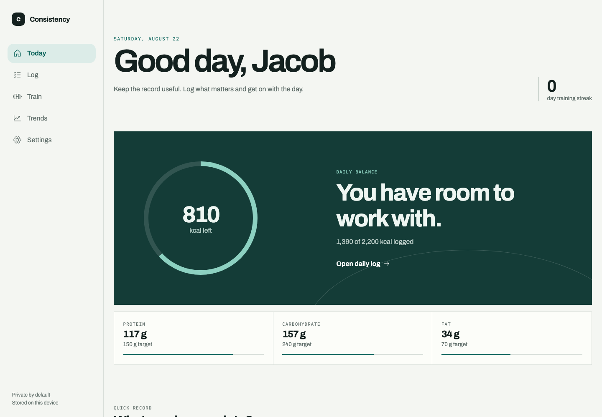
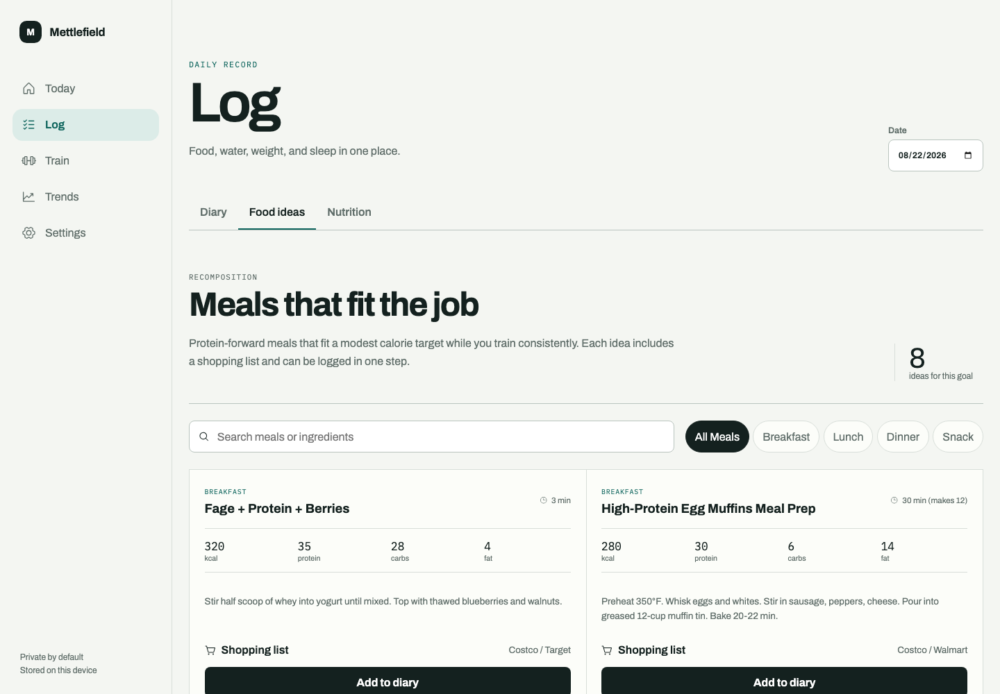
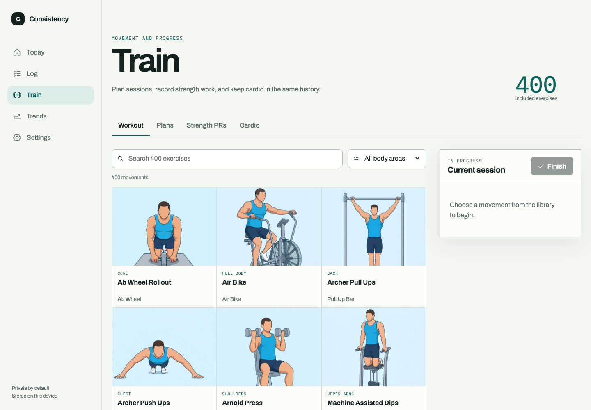
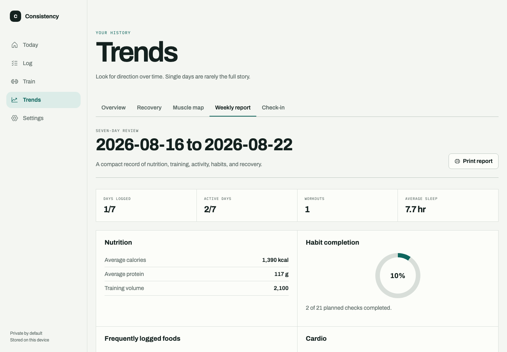
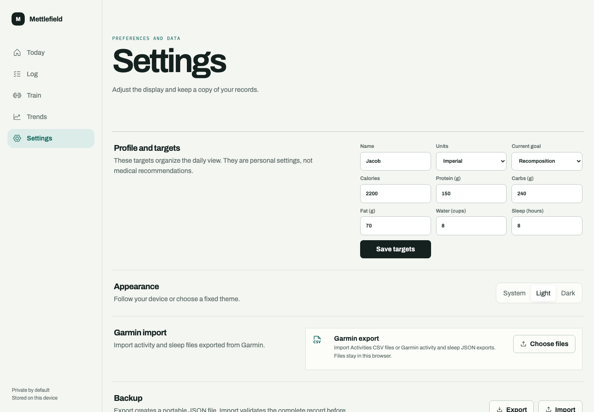

# Mettlefield

Mettlefield is a private health and training log for food, recovery, workouts, cardio, and progress. It runs entirely in the browser, requires no account, and keeps the record on the current device.

[Live site](https://jacobcoleman921.github.io/HealthCore/)



## What it does

- Searches 719 retained common foods or records label-specific values manually
- Records meals, calories, macros, water, weight, and sleep
- Retains 52 meal ideas from the original project, with shopping lists and one-step diary logging
- Includes a searchable library of 400 exercises with licensed movement illustrations
- Saves workout sets, plans, estimated strength records, and cardio sessions
- Shows weight, training, recovery, muscle-group, and weekly trends
- Imports Garmin activity CSV files and compatible activity or sleep JSON exports
- Exports and restores the full local record as JSON
- Supports light, dark, and device themes

The primary navigation stays deliberately small: Today, Log, Train, Trends, and Settings. Related tools live inside those destinations rather than in a long feature menu.

## Product views

| Food ideas | Training library |
| --- | --- |
|  |  |

| Weekly report | Settings and import |
| --- | --- |
|  |  |

## Run locally

```bash
npm install
npm run dev
```

The Vite development server prints the local URL. The project is configured for the `/HealthCore/` GitHub Pages base path.

## Verify the project

```bash
npm run typecheck
npm test
npm run check:copy
npm run test:e2e
npm run build
```

The browser suite checks every primary destination and subview on desktop and mobile, exercises catalog food, meal-idea, and cardio logging, checks horizontal overflow, and runs an automated accessibility pass.

## Architecture

- React 19, TypeScript, Vite, and React Router
- Zustand state with validated local storage persistence
- Recharts for trend views
- Motion for brief route transitions with reduced-motion support
- Zod validation for backups and migrated records
- Playwright, axe-core, Vitest, and Testing Library for verification

Large routes are loaded on demand. Exercise data is accessed through a repository interface so the provider can be replaced without rewriting the training interface.

## Data and privacy

Mettlefield has no hosted user database and no account system. Food, workout, recovery, and profile records remain in the browser unless the user exports a backup. Garmin files are parsed locally.

The check-in view is a deterministic summary of saved records. It does not call a chat service or present a medical diagnosis.

## Exercise data

Exercise metadata and movement images are provided by [RepDB](https://repdb.co/free-exercise-dataset) under its free-tier terms. The included license and attribution files are copied to `public/credits` and surfaced inside Settings.

Gym Visual media was evaluated but not included because cloning a repository does not grant a separate downstream media license. No generated exercise artwork is used.

## Project history

Mettlefield replaces the original single-file HealthCore application with a typed, tested component architecture while preserving the useful parts of that product. A feature-parity record is available in [docs/feature-parity.md](docs/feature-parity.md). The original application is preserved at `docs/legacy/healthcore-monolith.html` for auditability.

The design research and source decisions are recorded in [docs/brain-wiki-source-ledger.md](docs/brain-wiki-source-ledger.md).

## Author

Jacob Coleman  
[github.com/JacobColeman921](https://github.com/JacobColeman921)
