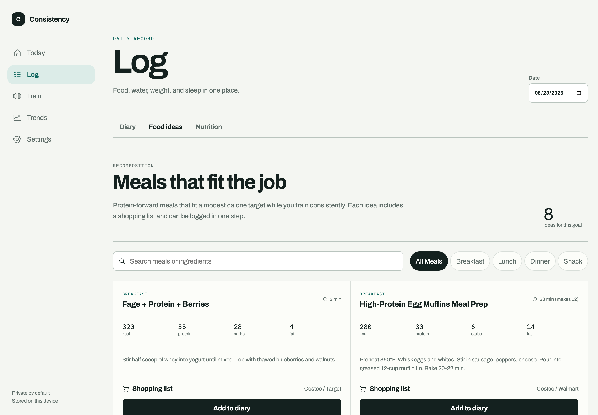
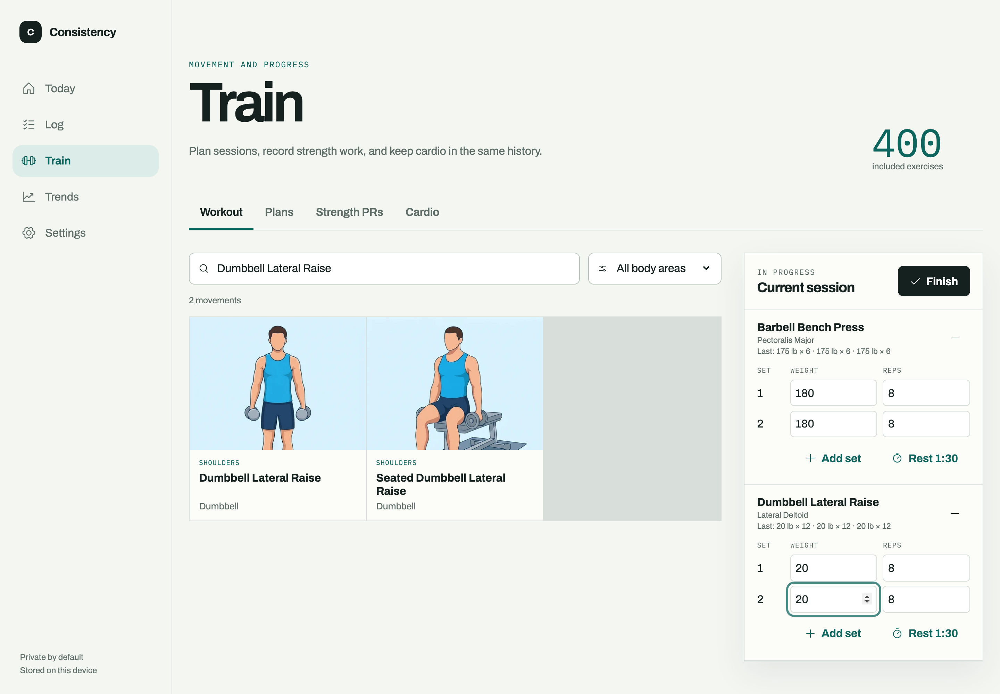
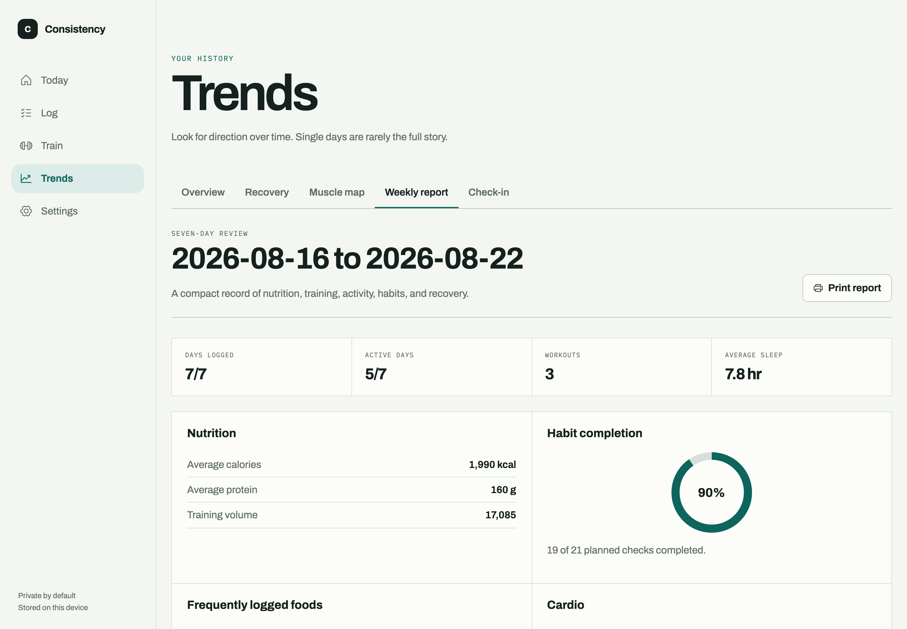

# Consistency

A personal training and nutrition record.

[Open the live site](https://jacobcoleman921.github.io/HealthCore/)


| Meal Ideas | Active Workout |
| --- | --- |
|  |  |



Consistency is a browser-based record for food, workouts, recovery, and progress. It keeps entries on the current device and does not require an account.

## What it includes

- A food diary for meals, calories, macros, water, weight, and sleep
- A retained catalog of 719 common foods and 52 meal ideas with shopping lists and one-step diary logging
- A searchable library of 400 RepDB exercises with licensed movement illustrations
- Workout sets, editable plans, strength records, cardio sessions, and Garmin activity or sleep imports
- Weight, training, recovery, muscle-group, and weekly views grounded in saved records
- Validated JSON export and restore, including a backup before a local reset
- Light, dark, and device theme choices

The application stays focused on five destinations: Today, Log, Train, Trends, and Settings. Related tools live within those destinations.

## Run locally

```bash
npm install
npm run dev
```

The project is configured for the `/HealthCore/` GitHub Pages base path.

## Verify the project

```bash
npm run typecheck
npm test
npm run check:copy
npm run test:e2e
npm run build
```

The browser suite covers primary destinations and subviews, food, meal, cardio, and workout flows, responsive overflow, and automated accessibility checks.

## Architecture

- React 19, TypeScript, Vite, and React Router
- Zustand state with validated local-storage persistence
- Recharts for trend views and Motion for reduced-motion-aware route transitions
- Zod validation for backups and migrated records
- Playwright, axe-core, Vitest, and Testing Library for verification

Large routes load on demand. Exercise data is accessed through a repository interface so its provider can be changed without rewriting the training interface.

## Data and privacy

Consistency has no hosted user database or account system. Food, workout, recovery, and profile records remain in the browser unless the person using the app exports a backup. Garmin files are parsed locally.

The Check-in view summarizes saved records deterministically.

## Exercise data and attribution

Exercise metadata and movement images are provided by [RepDB](https://repdb.co/free-exercise-dataset) under its free-tier terms. The included license and attribution files are copied to `public/credits` and surfaced inside Settings.

Gym Visual media was evaluated but not included because cloning a repository does not grant a separate downstream media license. No generated exercise artwork is used.

## Project history

Consistency replaces the original single-file HealthCore application with a typed, tested component architecture while preserving useful product data. The [feature-parity record](docs/feature-parity.md) documents the transition, and the original application remains at `docs/legacy/healthcore-monolith.html` for auditability.

The design research and source decisions are recorded in [docs/brain-wiki-source-ledger.md](docs/brain-wiki-source-ledger.md).

## Author

Jacob Coleman  
[github.com/JacobColeman921](https://github.com/JacobColeman921)
